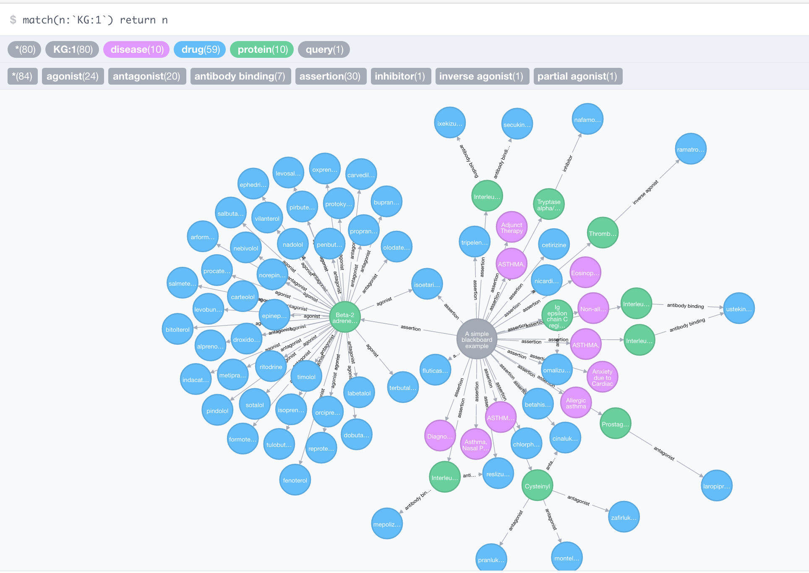

A Simple Blackboard Architecture
================================

This repository contains a simple, REST-based blackboard architecture
implementation. This implementation provides some basic plumbing for a
blackboard and an example knowledge source that interacts with it. 

```
./activator run
```

If all goes well, then try the following:

```
curl --data-ascii @asthma.json -H 'Content-Type:application/json' http://localhost:9000/blackboard/api/kg
```

where ```asthma.json``` is a file containing the following payload:

```
{
    "type": "query",
    "name": "A simple blackboard example",
    "term": "asthma"
}
```

Now try

```
curl http://localhost:9000/blackboard
```

There should be a new knowledge graph created with a single query node. To
update this knowledge graph using the [Pharos](https://pharos.nih.gov)
knowledge source we can use the following call:

```
curl -X PUT http://localhost:9000/blackboard/api/kg/1/ks.pharos
```

If all goes well, now rerun

```
curl http://localhost:9000/blackboard/api
```

to see that the knowledge graph has been updated with new nodes contributed by
the [Pharos](https://pharos.nih.gov) knowledge source. Note that each
time the [Pharos](https://pharos.nih.gov) knowledge source is run, it makes
contributions to the knowledge graph by iterating over all the available
nodes in the graph. After the first iteration, the knowledge graph contains
nodes that are related to the query. Let's extend these nodes further
by rerunning the knowledge source:

```
curl -X PUT http://localhost:9000/blackboard/api/kg/1/ks.pharos
```

The knowledge graph should now contains new nodes and edges. To see a
more visually pleasing knowledge graph, you can shutdown
activator by hitting <kbd>Ctrl</kbd>+<kbd>D</kbd> then point your
[Neo4j client](https://neo4j.com/download/community-edition/) to the
database `blackboard.db`. Once logged in, you can issue this query

```
match(n:`KG:1`) return n
```

This should return a knowledge graph similar to the one shown here:


